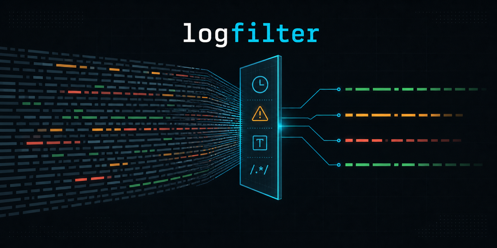

# logfilter

English | [日本語](./README.ja.md)

[](https://github.com/scenario-test-framework/logfilter/actions/workflows/ci.yaml)
[](https://github.com/scenario-test-framework/logfilter/releases/latest)
[](./go.mod)
[](https://github.com/scenario-test-framework/logfilter/pkgs/container/logfilter)
[](./LICENSE)



`logfilter` extracts the log events you need from large files by time range, log level, text, or regular expression. It preserves multiline events such as stack traces and supports common Japanese character encodings in addition to UTF-8.

It is distributed as a single Go binary and maintains command-line compatibility with the original Java implementation.

## Features

- Filter log events by time range, log level, substring, or [RE2 regular expression](https://github.com/google/re2/wiki/Syntax).
- Keep continuation lines, including stack traces, together with the preceding timestamped event.
- Read and write UTF-8, Shift_JIS (CP932), EUC-JP, ISO-2022-JP, and UTF-16, including common encoding aliases.
- Run as a native binary or a multi-architecture container image.
- Reuse JSON configuration while overriding individual settings from the command line.

## Quick start

Install the latest release with Go:

```sh
go install github.com/scenario-test-framework/logfilter@latest
```

Extract `WARN` and `ERROR` events from a log file:

```sh
logfilter -l 'WARN,ERROR' ./app.log ./filtered.log
```

You can also run the container image without installing the binary:

```sh
docker run --rm \
  -u "$(id -u):$(id -g)" \
  -v "$PWD:/work" \
  ghcr.io/scenario-test-framework/logfilter:latest \
  -l 'WARN,ERROR' /work/app.log /work/filtered.log
```

## Typical workflow

1. Prepare a log file whose events start with either an Apache access-log timestamp or a supported date/time value. Lines without a timestamp are treated as continuations of the preceding event.
2. Choose one or more filters. For example, combine a time range with `-tf` and `-tt`, select levels with `-l`, or search event content with `-s` or `-r`.
3. Run `logfilter`, specifying the input and output paths. You may omit the output positional argument only when `outputFilePath` is set in a configuration file.
4. Read the filtered file. A successful match exits with code `0`; no matching events exits with code `3`; invalid input or another error exits with code `6`.

For example:

```sh
logfilter \
  -tf '2016-11-06 12:17:53.000' \
  -tt '2016-11-06 12:18:00.000' \
  -l 'WARN,ERROR' \
  ./app.log ./filtered.log
```

## Supported log formats

### Apache access logs

```text
127.0.0.1 - name [10/Oct/2000:13:55:36 +0900] "GET /apache_pb.gif HTTP/1.0" 200 2326
```

### Timestamp, log level, and message

The parser accepts the following timestamp components:

- Date: `yyyy/MM/dd`, `yy/MM/dd`, `yyyy-MM-dd`, `yy-MM-dd`, or `yyyyMMdd`
- Date/time separator: a space or `T`
- Time: omitted, `HH:mm`, `HH:mm:ss`, `HH:mm:ss.SSS`, or `HH:mm:ss,SSS`
- Time zone: ISO timestamps using the `T` separator accept `Z` or a numeric offset such as `+09`, `+0900`, or `+09:00`. Apache access-log timestamps include an offset. Space-separated timestamps are interpreted in the local time zone.

The log level is recognized when it appears between spaces, such as ` ERROR `, or immediately after `[`, such as `[ERROR]`. Level names are not restricted to a fixed set, so values such as `TRACE`, `ERROR`, `FINEST`, and `FATAL` are supported.

```text
2016-11-06 12:17:53.985 DEBUG 15765 [main] Example : Starting validation
2016-11-06 12:17:54.022 ERROR 15765 [main] Example : Validation failed
The second line of this event has no timestamp.
```

## Installation

### GitHub Releases

Download the archive for your platform from [GitHub Releases](https://github.com/scenario-test-framework/logfilter/releases/latest), then extract and install the binary:

```sh
tar xvfz ./logfilter_*.tar.gz
mv ./logfilter_*/logfilter /usr/local/bin/
```

### Go

```sh
go install github.com/scenario-test-framework/logfilter@latest
```

### Docker

```sh
docker pull ghcr.io/scenario-test-framework/logfilter:latest
```

## Usage

```text
logfilter [OPTION] inputFilePath [outputFilePath]
```

Examples:

```sh
# Show help
logfilter -h

# Filter by time range
logfilter -tf '2016-11-06 12:17:53.000' -tt '2016-11-06 12:18:00.000' ./app.log ./filtered.log

# Filter by log level
logfilter -l 'WARN,ERROR' ./app.log ./filtered.log

# Filter by substring or regular expression
logfilter -s 'Exception' ./app.log ./filtered.log
logfilter -r 'ERROR|Exception' ./app.log ./filtered.log

# Load a configuration file and override one value
logfilter -cf ./config.json -tf '2016-11-06' ./app.log ./filtered.log
```

### Options

| Option | Description |
|---|---|
| `-h`, `--help` | Show command usage. |
| `-f`, `--force` | Do not ask for confirmation before overwriting an existing output file. |
| `-cf`, `--configFile` | Read settings from a JSON configuration file. |
| `-ic`, `--inputCharset` | Input encoding. The default is UTF-8. |
| `-oc`, `--outputCharset` | Output encoding. The default is the input encoding. |
| `-tf`, `--timeFilterFrom` | Include events at or after this time. |
| `-tt`, `--timeFilterTo` | Exclude events at or after this time. |
| `-l`, `--logLevelFilter` | Comma-separated log levels to include. |
| `-s`, `--stringContentFilter` | Substring that the event must contain. |
| `-r`, `--regexFilter` | RE2 regular expression that the event must match. |

### Configuration file

```json
{
  "inputCharset": "UTF-8",
  "outputFilePath": "",
  "outputCharset": "",
  "timeFilterValueFrom": "",
  "timeFilterValueTo": "",
  "logLevelFilterValueList": ["WARN", "ERROR"],
  "stringContentFilterValue": "",
  "regexFilterValue": ""
}
```

The input file is always supplied as a positional command-line argument. When the output positional argument is omitted, `outputFilePath` from the configuration file is used.

Command-line filter and encoding options override corresponding values from the configuration file.

### Exit codes

| Code | Meaning |
|---|---|
| `0` | Completed successfully. |
| `3` | Completed with no matching log events. |
| `6` | Failed because of invalid input or another error. |

## Running with Docker

Mount the directory containing your logs into `/work`. Set `TZ` when timestamps without an explicit offset should be interpreted in a local time zone; otherwise, they are interpreted as UTC.

```sh
docker run --rm \
  -u "$(id -u):$(id -g)" \
  -e TZ=Asia/Tokyo \
  -v "$PWD:/work" \
  ghcr.io/scenario-test-framework/logfilter:latest \
  -l 'WARN,ERROR' /work/app.log /work/filtered.log
```

Using the host user and group with `-u "$(id -u):$(id -g)"` ensures that the output file is owned by the current host user.

With [Docker Compose](./compose.yaml):

```sh
docker compose run --rm logfilter -l 'WARN,ERROR' /work/logs/app.log /work/logs/filtered.log
```

## Development

Go 1.25 or later is required.

```sh
make        # vet, test, and build
make cross  # build release archives in dist/
```

| Workflow | Trigger | Purpose |
|---|---|---|
| [CI](./.github/workflows/ci.yaml) | Push or pull request | Vet, test, compile, and verify the container build. |
| [Release](./.github/workflows/release.yaml) | Push of a `v*` tag | Publish release archives and amd64/arm64 container images. |

Internal development documentation and source-code comments are primarily written in Japanese.

## License

Licensed under the [Apache License 2.0](./LICENSE).
